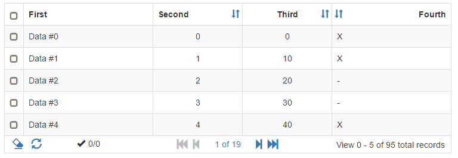


#Table Factory
------------------------------------------------------------------------
TableFactory is an angular module '*ngTableFactory*' to create tables like this image:

- All data or paged
- Header and footer visibility control
- Sortable columns
- Selection on table row, row checkbox or both
- Checkbox for check all/none when in multiple selection integrated in table header
- Formatter functions to customize cell content
- Clear Selections and Data Reload command buttons integrated in table footer
- Customizable css/icons/labels
- Directives to use table factory in page/dropdowns/modal

[Getting Started](docs/getting-started.md) for usage samples.

[Documentation](docs/summary.md) for a complete reference.

------------------------------------------------------------------------
